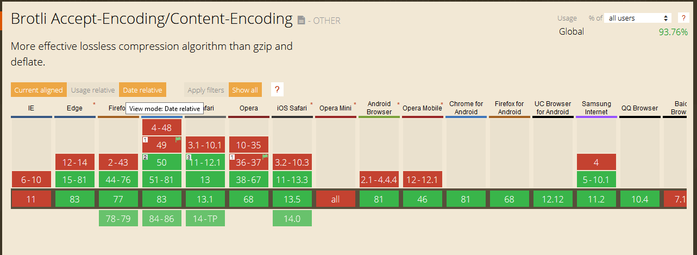

# be-2020

Little backend prototype for `Thunder Dating`, an assessment for [Backend development](https://github.com/cmda-bt/be-course-19-20).

[Heroku link](https://be-2020.herokuapp.com/)

In this app you can signup/register and meet other people by chatting with them or checking out their wall.
This website is built PE first, so no JS was hurt in the client whilst setting up the base for this app.

# Table of contents

* [Install](#install)
    * [Additional notes](#additional-notes)
* [Deployment](#deployment)
* [Tech stack](#tech-stack)
* [Feature](#feature)
* [Scheme](#scheme)
* [Topics (A2)](#topics-a2)
* [TLDR;](#tldr)
* [TODO](#todo)
    * [MVP](#mvp)
    * [BACKLOG](#backlog)
* [Resources](#resources)
    * [Insightful resources](#insightful-resources)

# Install

```bash
    # Running locally?
    npm i && npm run start
```

```bash
    # Running locally and for dev?
    npm i && npm run dev
```

## Additional notes

For this project to run smoothly make sure you have a working and running [MongoDB Atlas cluster](https://www.mongodb.com/cloud).

The `.env` file should contain the following
```env
    MNG_URI = mongo server uri
    SESSION_HASH = a unique hash for signing server side sessions
    PORT = the port to run on locally
```

# Deployment

The current [prototype](https://be-2020.herokuapp.com/) is being deployed on [Heroku](https://www.heroku.com/).
Every commit to the `release` branch will trigger an automatic deployment.

# Tech stack

The main npm package drivers of this project:

- bcrypt
- body-parser
- Ejs
- Express
- Express-session
- mongodb
- mongoose

<details>
    <summary>Other Dependencies</summary>

- dotenv
- Concurrently
- Gulp (and small gulp packages)
- nodemon
- node-fetch
- node-sass

</details>

# Feature

I want people to be able to login without a hitch, and be able to change their profile info. Apart from that I'd like to create a wall where the users can post messages so that they can make themselves as interesting as they want you to think. You'll also be able to match with others based on simple preferences and chat with them.

**notes**

* Some people won't want their data given out for free to other strangers on the web.

# Scheme

## User

<details>
<summary> 
    User Schematic for mongoDB 
</summary>

```js
{
    objId: objectId,
    displayName: {
        type:String,
        required: true,
    },
    password: {
        type:String,
        required: true
    },
    firstName: {
        type:String,
        required: true
    },
    middleName: {
        type:String
    },
    lastName: {
        type:String,
        required: true
    },
    favoriteColor: {
        type:String,
        required: true
    },
    dob: {
        type: Date,
        required: true
    },
    bio: {
        type:String,
    },
    email: {
        type: String, 
        unique: true
    },
    gender:{
        type: String,
        required: true
    },
    hidePersonalData:{
        type: Boolean,
        required: true,
        default: true
    },
    uid:{
        type: String,
        require: true
    }
}
```

</details>

## Posts

**posts** Schematic for mongoDB

*WIP*

## Chat

**chat** Schematic for mongoDB

*WIP*

# Topics (A2)
## Deploy your node app  and .env variables

The app has been deployed on [heroku](https://be-2020.herokuapp.com/) and makes use of the `dot-env` package to handle keys locally. 

## Compress assets that get send to the client

The app makes use of `compression`. A npm package that handles gzip'ing request that come from the node server.

<details>
<summary>Research</summary>

To reduce loading times and make your website less data hungry it's your best interest to compress the files sent to the end user.
There are currently 2 main methods compressing assets, `gzip` and `brotli`.

`brotli` would be the "better" choice if you're going for the most aggressive compression. The files will on average be bit smaller. However since it's not as well support as `gzip` I opted for that instead.




[Brotli benchmarks](https://www.opencpu.org/posts/brotli-benchmarks/)
[Reduce network payloads using text compression](https://web.dev/reduce-network-payloads-using-text-compression/)
[Compression](https://github.com/expressjs/compression)
</details>

## Hash the passwords you store in the database

The passwords have been hashed and salted by `bcrypt`. The database only has encrypted passwords.

<details>
<summary>Research</summary>

Keeping your account safe and secure is of course a big deal. Now that hackers get relatively good tools for less compared to the olden days it's in a developers best interest to keep user accounts safe. Many hackers/breaches have brought to light that some hashing methods and mechanism aren't up to par to todays standard.

I thought about digging into hashing and salting basic passwords myself but decided against it since doing it myself would mean I'd need a deep understanding of how to encrypt with algorithms. I did try a Caesar Cypher but that Idea went down the drain as I read `Salted Password Hashing Doing It Right`. Instead I found a simpler way to "encrypt" user passwords aside from also using `bcrypt`. Before a user registers I run the string along an array of the most common credentials in recent years. This means that at the very least the password itself is inherently more secure. Another way to prevent things like a brute force attack is to limit the amount of login attempt from an IP address.
 
Recources and references concerning the subject:

- [Salted Password Hashing Doing it Right](https://www.codeproject.com/Articles/704865/Salted-Password-Hashing-Doing-it-Right)
- [Common Credentials (Raw File)](https://raw.githubusercontent.com/danielmiessler/SecLists/master/Passwords/Common-Credentials/10-million-password-list-top-10000.txt)
</details>

## Split up route logic in modules 

All code has been split up into modules. Be it for routes in `/dev/modules/routes` or other stuff like encryption (`/dev/modules/encryption`) and db (`/dev/modules/db`) functions.

<details>
<summary>Research</summary>

Routing in a webapp is very neat but also very necessary. Previously my routing for backend applications was always a mess.
My `server.js` would be filled to the brim with route logic and how to handle templates. This would mean my server would be messy read and a total pain in the ass to work with. That's why I decided to not only divvy up the functionalities in modules but also write middleware for routes. This allows me to keep my `server.js` clean and easy to read and keeps all routes neatly bundled within their own route file.

```js
    // Old Situation, Single Route
    // Server.js
    app.get('/',(req,res)=>{
        if(req.session.user){
            res.redirect('/profile')
        }else{
            res.render('pages/home',{})
        }
    })
```

```js
    // New Situation, Single route
    // Server.js
    const index = require('./dev/modules/routes/index')
    app.use('/',index)
```

As you can see here, more complicated routes with more and more logic would make for a massive wall of code in the main `server.js` file. Now that I've split up the code in little modules it allows me to import them wherever I wish. With this in mind I also split up other logic in little modular bites so that they may be imported and used elsewhere. This keeps the code cleaner and easier to work with.

Recources and references concerning the subject:
- [Express Routing](https://expressjs.com/en/guide/routing.html)
</details>

## Handle exceptions properly

Form checking and error handling has been setup but hasn't had a thorough implementation.

# TLDR;
With [this app](https://be-2020.herokuapp.com/) people can: 

1. User visits the website and creates a new account (`/register`)
2. The user proceeds to login (`/login`)
3. The user can then see other profiles (`/profile/:uid`) or change it's own (`/profile/:uid/edit`) 

*todo*

4. Users can add posts to their own wall
5. Users can connect through basic preferences
6. Users can chat with each other once they match

# TODO

## MVP

* [x] Basic Login/register Flow
* [x] Basic sessions with JTW or SS Sessions
* [x] Basic Styling
* [x] User Profiles
* [x] Editable Profiles
* [x] List other Users
* [x] View other Users

## BACKLOG

* [ ] Redesign App
* [ ] Better Server Side Feedback form validation
* [ ] Add wall/posts to profiles
* [ ] Client Side feedback form validation
* [ ] Add "Online" functionality
* [ ] Add Matching with other users
* [ ] Add Chatting (RT?) with other users
* [ ] Look into JTW for sessions instead of SS sessions?
* [ ] Hybrid Filter/Login?
* [ ] Image uploads for profiles/posts?

# Resources
- [MongoDB - Node](http://mongodb.github.io/node-mongodb-native/3.4/quick-start/quick-start/)
- [MongoDB - CodeCamp](https://www.freecodecamp.org/news/introduction-to-mongoose-for-mongodb-d2a7aa593c57/)
- [Express](https://expressjs.com/en/4x/api.html)
- [Express Sessions](https://www.npmjs.com/package/express-session)
- [Gulp](https://gulpjs.com/docs/en/api/concepts/)
- [Multer, GridFS](https://bezkoder.com/node-js-upload-store-images-mongodb/)

### Insightful resources
- [JWT "vs" Sessions](https://stackoverflow.com/questions/43452896/authentication-jwt-usage-vs-session)
- [Authentication with JWT](https://blog.usejournal.com/sessionless-authentication-withe-jwts-with-node-express-passport-js-69b059e4b22c)
- [Pagination](https://codeforgeek.com/server-side-pagination-using-node-and-mongo/)
- [Generate UID](https://stackoverflow.com/questions/18524125/req-query-and-req-param-in-expressjs)
- [Salted Password Hashing Doing it Right](https://www.codeproject.com/Articles/704865/Salted-Password-Hashing-Doing-it-Right)
- [Common Credentials (Raw File)](https://raw.githubusercontent.com/danielmiessler/SecLists/master/Passwords/Common-Credentials/10-million-password-list-top-10000.txt)
- [Reduce network payloads using text compression](https://web.dev/reduce-network-payloads-using-text-compression/)
- [Express Routing](https://expressjs.com/en/guide/routing.html)
- [Brotli benchmarks](https://www.opencpu.org/posts/brotli-benchmarks/)
- [Reduce network payloads using text compression](https://web.dev/reduce-network-payloads-using-text-compression/)
- [Compression](https://github.com/expressjs/compression)

# LICENSE

MIT License

Copyright (c) 2020 Maikel Sleebos

[read full license](LICENSE)